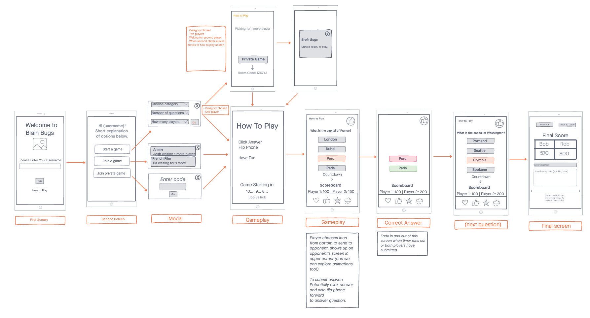

# Brain Bugs - React Native Multiplayer Trivia Game

## The Team
   
Josh Williams - [GitHub](https://github.com/jswill88) || [LinkedIn](https://www.linkedin.com/in/joshua-s-williams/)   
Daisy Johnson - [GitHub](https://github.com/daisyjanejohnson) || [LinkedIn](https://www.linkedin.com/in/daisyjane-johnson/)   
Chris Hamersly - [GitHub](https://github.com/christopherhamersly) || [LinkedIn](https://www.linkedin.com/in/christopher-hamersly/)
Tia Low - [Github](https://github.com/TiaLow) || [LinkedIn](https://www.linkedin.com/in/tia-low/)

## The App

(short description here)

### Features

- 
- 
- 

## Install

## Usage

## Contributing

## UML / Event Flow

## Wireframe

## Libraries

## Resources

## License
